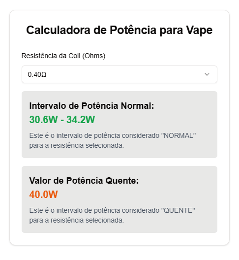

# Vape Power Calculator

A simple React application to calculate the power range for vape coils based on their resistance created in next.js.

## Features

- Select coil resistance from a dropdown
- Display normal power range for the selected resistance
- Display hot power value for the selected resistance

## Installation

1. Clone the repository:

```sh
git clone https://github.com/yourusername/vape-power-calculator.git
```

2. Navigate to the project directory:

```sh
cd vape-power-calculator
```

3. Install dependencies:

```sh
npm install
```

## Usage

1. Start the development server:

```sh
npm run dev
```

2. Open your browser and navigate to `http://localhost:3000`.

## Screenshot



## License

This project is licensed under the MIT License.
